# dlt645 protocol

重点看 1.DLT645 请求应答帧

### 0 参考作者

参考作者:[Simba X](https://blog.csdn.net/weixin_41218348) https://blog.csdn.net/weixin_41218348/article/details/126520456

### 1.DLT645 请求应答帧

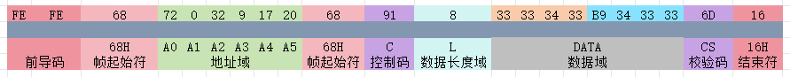

#### 1.1 前导码+帧起始符

​	**FE FE**为前导码，用于发送方让接收方提前准备好接收数据.寻找数据帧中的**68**帧头作为一帧的起始位置,68帧尾作为标号结束阶段

#### 1.2 地址域(表号)

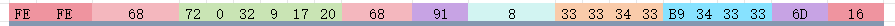

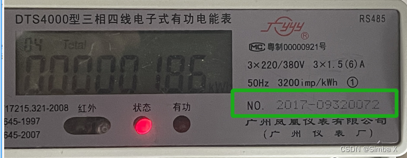

从第一个68开始到第二个*68*之间的绿色数据为表号字段，在DLT645协议中规定，表号字段，数据字段都是逆序的，也就是与实际表号循序相反，我们要得到实际表号，需要反转数据帧中的表号字段 *72 00 32 09 17 20*，反转后我们得到：*20 17 09 32 00 72*，

#### 1.3 控制码

07协议如下:

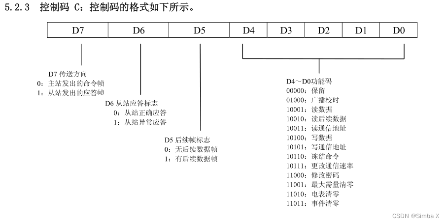

一字节/两字符/8位/16进制 数据 91 为帧控制码,决定数据帧的帧类型,判断是07还是97协议,也可通过此判断为请求帧还是应答帧. 

解析控制码，我们需要将十六进制的控制码**91**转换成二进制数据**10010001，**高位的1对应上图控制码中的D7位，我们将转换后二进制数据一一对应到上图中，得出**91**的含义为主站发送的读数据应答帧，从站正确应答，且无后续数据帧。

#### 1.4 数据长度域 + 数据域

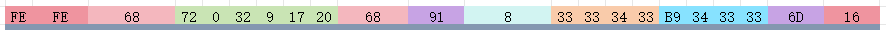

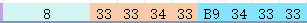

8表示数据长度域,代表后面数据域的长度为 8个字节,即:

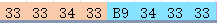

棕色为数据项标识部分,蓝色为数值部分.  两者都是逆序传输的且需要减去16进制 0x33.

协议参考

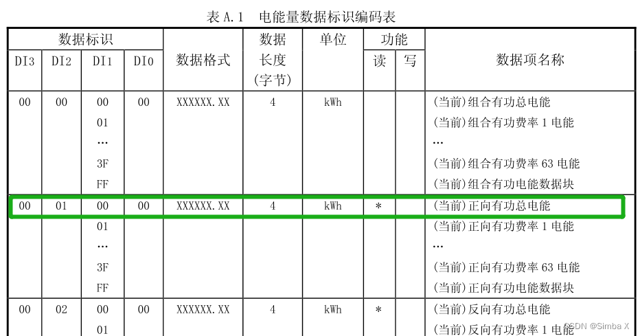

##### 数据项标识计算:

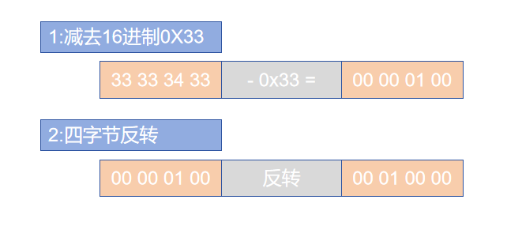

#### 数值计算

最终计算得到00 00 01 86, 根据上方数据标识项查找到数据格式为xxxxxx.xx,即数值为 00 00 01.86 kWh

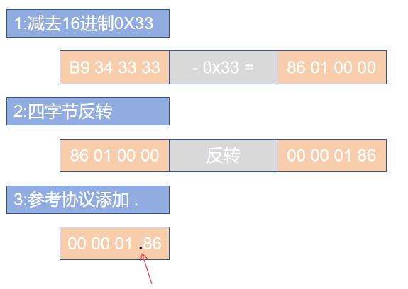

#### 1.5 校验码

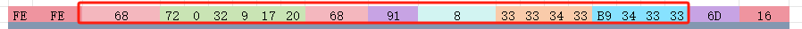

采用16进制加法计算:

`68 + 72 + 00 + 32 + 09 +17 + 20 + 68 + 91 + 08 + 33 + 33 + 34 + 33 + B9 + 34 + 33 + 33 = 46D`

超出一个字节的高位 忽略掉,得到最终校验和 `6D`
