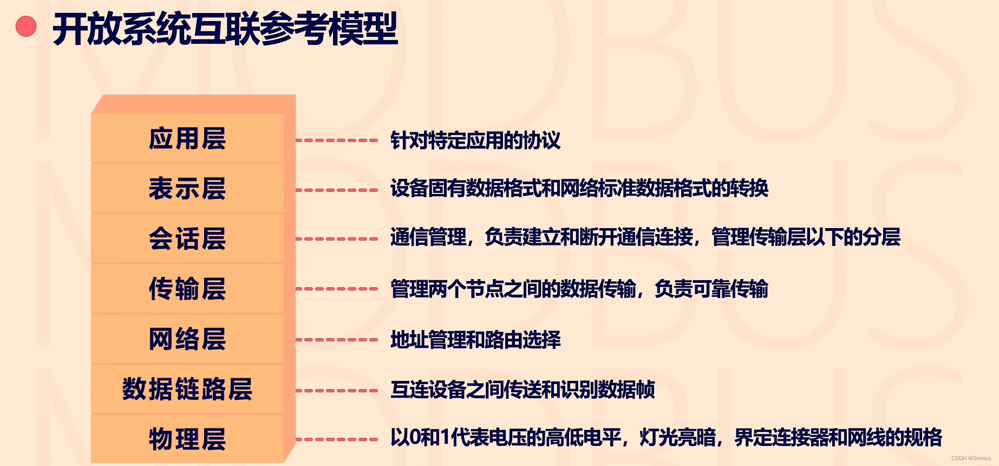
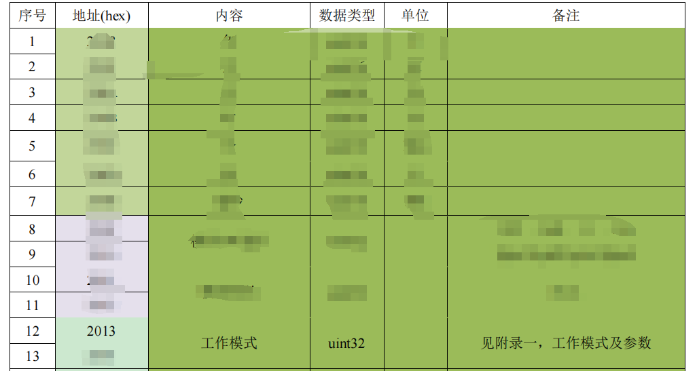
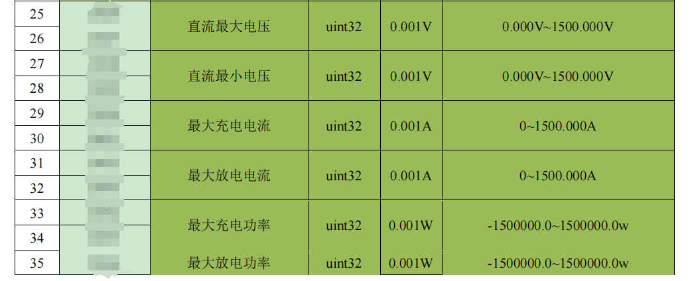
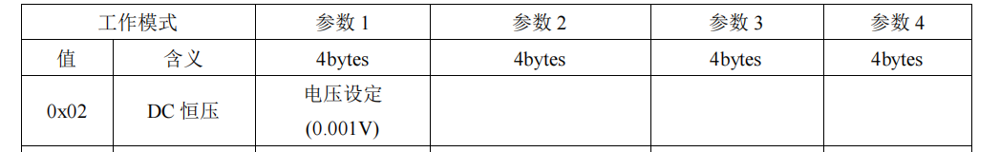
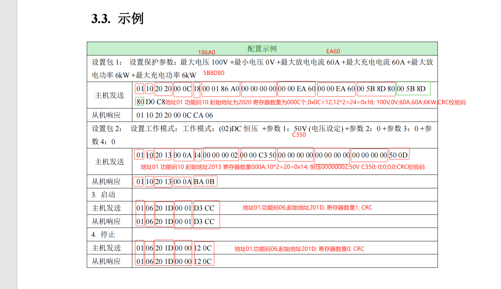

# modbus

重点看 3 实际案例的案例解析图片

### 0 参考作者

参考作者: [Smacq](https://blog.csdn.net/Smacq)   https://blog.csdn.net/Smacq/article/details/127067002

参考作者: [成都亿佰特电子科技有限公司](https://blog.csdn.net/CDebyte)  https://blog.csdn.net/CDebyte/article/details/125931312

### 1 开放互联网参考模型

[Modbus通信协议](https://so.csdn.net/so/search?q=Modbus通信协议&spm=1001.2101.3001.7020)作用在OSI模型的物理层（1层）、数据链路层（2层）及应用层（7层）。这里的OSI被称为开放系统互联参考模型，它定义了网络互连的七层框架，每层框架都有其各自的通信协议。

### 2 协议报文说明

Modbus协议有三类，分别是：Modbus-RTU、Modbus-ASCII、Modbus-TCP、Modbus-Plus。

大多主要为RTU,其主要报文格式为:  

### 3 实际案例

#### 3.1 协议:

#### 3.2 案例

### 4 其他案例:

请参考作者: [成都亿佰特电子科技有限公司](https://blog.csdn.net/CDebyte)  https://blog.csdn.net/CDebyte/article/details/125931312