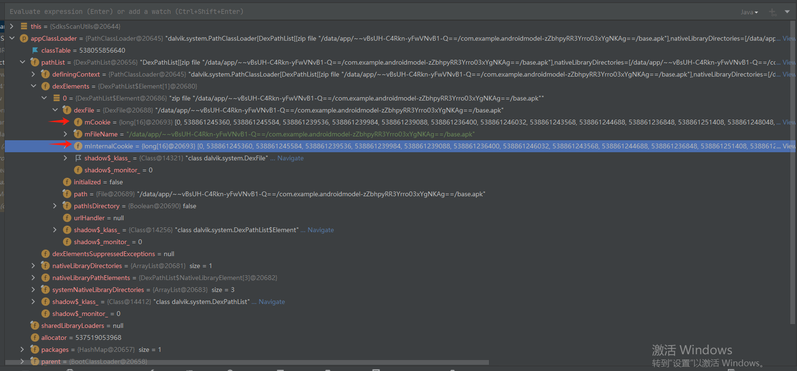

# 扫描App使用的第三方SDK

## 一、 概述

```Java
方案: 应用层准备第三方sdkFeaturesMap,修改framework层ActivityThread.java源码,通过反射来遍历classLoader,然后获取到加载过的classNames;每一条都与sdkFeaturesMap比对,记录使用过的sdk。
通过类加载器存储app启动后加载的类名,然后通过比对sdk的特征包名,判定使用的sdk
流程:
testTaskFlow() // prepare and dump classNames
testGetResult  // wait some time and then get results;
重点是 apkPath 参数
流程:
---> 下载apk完成
---> 安装apk完成
---> 设置系统属性 setProp("zzz.dumpclass.name", packageName) ---> 在 framework 层决定是要做 dump class names 还是 unShell
---> app 在apk对应目录下写入特征 featureMap.txt ;
---> app 系统权限(chown -R uid:uid dir) ---> mkdir; touch; mv; chown
---> 启动app
---> 加载 featureMap到framework层
---> dump class names,有一条就和 featuresMap 比对,有新的sdks时,利用sdkScanResultBuffer结果去重后就写Txt;
---> app 查看 sdk scan 结果: mkdir; touch; cp!!!;chown shell permission; read File
```

## 二、 实现

## 1..理解classLoader

请参考文章: "https://www.jianshu.com/p/7c59391f0658"



根据上图，依次反射获取到类加载器的数值，最后根据mCookie和mInteralCookie反射 

art/runtime/native/dalvik_system_DexFile.cc  ---> static jobjectArray DexFile_getClassNameList(JNIEnv* env, jclass, jobject cookie)

得到当前classLoader的类名数组；

## 2.SdksScanUtil.java

请仔细看对应的文章开头注释；

### 2.1 sdkFeaturesMap

```Java
//app使用的第三方sdk的特征字典; key-value sdk_packageName_feature - sdk_id
private static final Map<String,String> sdkFeaturesMap = new HashMap<>();
public Map<String, String> getSdkFeaturesMap(){
        return sdkFeaturesMap;
}
private void initSdkFeaturesMap() {
        sdkFeaturesMap.put("zendesk.messaging",                     "1");
        sdkFeaturesMap.put("com.segment.analytics",                 "2");
        sdkFeaturesMap.put("org.prebid",                            "3");
        sdkFeaturesMap.put("org.osmdroid",                          "4");
        sdkFeaturesMap.put("com.iab.omid",                          "5");
        sdkFeaturesMap.put("com.newrelic.agent.android",            "6");
        sdkFeaturesMap.put("com.my.target",                         "7");
        sdkFeaturesMap.put("com.facebook.ads",                      "8");
}	
```

### 2.2 获取包名

```
private String apkPath = "data/local/tmp/zzz.apk";
private PackageManager packageManager = context.getPackageManager();
private PackageInfo = packageManager.getPackageArchiveInfo(apkPath, 0);
private String packageNameApk = packageInfo != null ? packageInfo.packageName : "";
```

### 2.3 设置新增系统属性

```Java
setProp("zzz.dumpclass.name", packageNameApk)

public static void setProp(String key, String value) {
    // android.os.SystemProperties
    // public static void set(String key, String val)
    try {
        Class<?> cls = Class.forName("android.os.SystemProperties");
        Method method = cls.getMethod("set", String.class, String.class);
        method.invoke(null, key, value);
    } catch (Exception e) {
        e.printStackTrace();
    }
}
```

### 2.4 writeSdksFeaturesToFile

```Java
public String writeSdksFeaturesToFile(){
    String sdksJson = new Gson().toJson(sdkFeaturesMap);
    mkFile(sdkFeaturesMapPathTdc);
    writeStringToFile(sdksJson,sdkFeaturesMapPathTdc);
    String sdkFeaturesMapPathDirApk = sdkFeaturesMapPathApk.substring(0,sdkFeaturesMapPathApk.lastIndexOf('/') );
    int uid = Kfflso_PackageUtil.getInstance(context).getPackageUid(packageNameApk);
    String[] commands = {
            "mkdir -p " + sdkFeaturesMapPathDirApk,
            "touch " + sdkFeaturesMapPathApk,
            "cp " + sdkFeaturesMapPathTdc + " " + sdkFeaturesMapPathApk,
            "chown -R " + uid + ":" + uid + " " + sdkFeaturesMapPathDirApk
    };
    String errInfo = "";
    for(String cmd : commands){
        errInfo = Kfflso_CmdUtil.execCmdPlus("/system/xbin/asu", "root", "sh", "-c", cmd);
        if(!errInfo.isEmpty()){
            Kfflso_LogsUtils.logToFileAsync(TAG,errInfo);
            break;
        }
    }
    return errInfo;
}

public void mkFile(String filePath){
	if(filePath.isEmpty()){
		return;
	}
    try {
    File file = new File(filePath);
    File parent = file.getParentFile();
    if(!parent.exists()){
         parent.mkdirs();
    }
    file.createNewFile();
    } catch (IOException e) {
         throw new RuntimeException(e);
    }
}

public void writeStringToFile(String string, String filePath){
    try (FileOutputStream fos = new FileOutputStream(filePath,false)){
        byte[] bytes = string.getBytes();
        fos.write(bytes);
        fos.flush();
    } catch (IOException e) {
        throw new RuntimeException(e);
    }
}    
  
```

### 2.5 cp

```Java
public static String execCmdPlus(String... commands){
    List<String> list = Arrays.asList(commands);
    StringBuilder result = new StringBuilder();
    try {
        Process process = new ProcessBuilder(commands).redirectErrorStream(true).start();
        BufferedReader stdin = new BufferedReader(new InputStreamReader(process.getInputStream()));
        String line;
        while ((line = stdin.readLine()) != null) {
            result.append(line).append("\n");
        }
        stdin.close();
    } catch (Exception e) {
        e.printStackTrace();
    }
    return result.toString();
}
```

### 2.6 launchTargetApp

```Java
public void launchTargetApp( ) {
    Intent launchIntent = context.getPackageManager().getLaunchIntentForPackage(packageNameApk);
    context.startActivity(launchIntent);
}
```

### 2.7 getSdkResults

```Java
/**
 *
 * @return 获取filePath中的文件内容
 */
public String getSdkResults() {
    String sdkFeaturesMapPathDirTdc = sdkFeaturesMapPathTdc.substring(0,sdkFeaturesMapPathTdc.lastIndexOf('/') );
    int shell = 2000;
    String[] commands = {
            "mkdir -p " + sdkFeaturesMapPathDirTdc,
            "touch " + sdkScanResPathTdc,
            "cp " + sdkScanResPathApk + " " + sdkScanResPathTdc,
            "chown -R " + shell + ":" + shell + " " + sdkFeaturesMapPathDirTdc
    };
    String errInfo = "";
    for(String cmd : commands){
        errInfo = Kfflso_CmdUtil.execCmdPlus("/system/xbin/asu", "root", "sh", "-c", cmd);
        if(!errInfo.isEmpty()){
            Kfflso_LogsUtils.logToFileAsync(TAG,errInfo);
            return errInfo;
        }
    }
    String sdks = readFileToString(sdkScanResPathTdc);
    return sdks;
}

public String readFileToString(String filePath){
    StringBuilder content = new StringBuilder();
    try (BufferedReader br = new BufferedReader(new FileReader(filePath))) {
        String line;
        while ((line = br.readLine()) != null) {
            content.append(line).append("\n");
        }
    } catch (IOException e) {
        e.printStackTrace();
    }
    return content.toString().trim();
}

```


## 3.Framework_ActivityThread

请仔细看对应的文章开头注释；

### 3.1 注意修改位置：

ActivityThread.java : `frameworks/base/core/java/android/app/ActivityThread.java`

```Java
//    private void handleBindApplication(AppBindData data) {
//        // ...
//            sendMessage(H.SET_CONTENT_CAPTURE_OPTIONS_CALLBACK, data.appInfo.packageName);
//            mInitialApplication = app;
//            // =====================================
//            sdkScanThread();
//            // =====================================
//            final boolean updateHttpProxy;
//        // ...
//    }

//    private Activity performLaunchActivity(ActivityClientRecord r, Intent customIntent) {
//        //...
//        // =====================================
//        sdkScanThread();
//        // =====================================
//        return activity;
//    }
```

### 3.1 sdkScanThread

```Java
//全局变量
private final String TAG = "Framework_ActivityThread";
private Set<String> sdkScanResultSet = new HashSet<>();

public void sdkScanThread() {
    if (shouldDumpClasses()) {
        new Thread(() -> {
            try {
                Log.e(TAG, "DumpClassesList start!");
                sdkScan();
                Log.e(TAG, "DumpClassesList complete!");
            }catch (Throwable e){
                Log.e(TAG, "error while DumpClassesList", e);
            }
        }).start();
    }
}

// 检测是否应该 dump className, 这里可通过判断有指定系统属性,就开始 dump
    public static boolean shouldDumpClasses() {
//        boolean ret = false;
//        String processName = ActivityThread.currentProcessName();
//        String target = SystemProperties.get("xxx.dumpclass.name");
//        if(processName != null && processName.equals(target)){
//            Log.e(TAG, "dumpclass target: "+target);
//            ret = true;
//        }
//        return ret;
        return true;
    }
```

### 3.2 sdkScan 实现！！！

```Java
public void sdkScan(){
      String processName = ActivityThread.currentProcessName();
    String processName = "com.example.testApp";//你启动的app的包名,这里恰巧和进程名称一致
    String sdkFeaturesMapPathApk = "/data/data/" + processName + "/dumpClassName/sdkFeaturesMap.txt";
    String sdkScanResPathApk = "/data/data/" + processName + "/dumpClassName/sdkScanResult.txt";
    String dumpClassNamesPath = "/data/data/" + processName + "/dumpClassName/apkDumpClassNames.txt";
    Kfflso_FileUtils.checkAndCreateFile(sdkFeaturesMapPathApk);
    Kfflso_FileUtils.checkAndCreateFile(sdkScanResPathApk);
    String json = Kfflso_FileUtils.readFileToString(sdkFeaturesMapPathApk);
    HashMap<String,String> sdkFeaturesMap = Kfflso_JsonUtils.jsonStrToHashMap(json);
    if(sdkScanResultSet.size() == 0){
        String sdkResult = Kfflso_FileUtils.readFileToString(sdkScanResPathApk);
        for(String result : sdkResult.split("\n")){
            sdkScanResultSet.add(result);
        }
    }
    ClassLoader parentClassloader = getClassloader();
    while (parentClassloader != null){
        if(!parentClassloader.toString().contains("java.lang.BootClassLoader")) {
            sdkScanImpl(parentClassloader, sdkScanResPathApk, sdkFeaturesMap,sdkScanResultSet, dumpClassNamesPath);
        }
        parentClassloader = parentClassloader.getParent();
    }
    sdkScanResultSet.clear();
}

public static ClassLoader getClassloader() {
        ClassLoader resultClassloader = null;
        Object currentActivityThread = Kfflso_ReflectionUtils.invokeStaticMethod
            ("android.app.ActivityThread", "currentActivityThread", new Class[]{}, new Object[]{});
        Object mBoundApplication = Kfflso_ReflectionUtils.getFieldOjbect
            ("android.app.ActivityThread", currentActivityThread, "mBoundApplication");
        Application mInitialApplication = (Application) Kfflso_ReflectionUtils.getFieldOjbect
            ("android.app.ActivityThread", currentActivityThread, "mInitialApplication");
        Object loadedApkInfo = Kfflso_ReflectionUtils.getFieldOjbect
            ("android.app.ActivityThread$AppBindData", mBoundApplication, "info");
        Application mApplication = (Application) Kfflso_ReflectionUtils.getFieldOjbect
            ("android.app.LoadedApk", loadedApkInfo, "mApplication");
        resultClassloader = mApplication.getClassLoader();
        return resultClassloader;
    }
```

### 3.3 sdkScanImpl  实现！！！

```Java
public void sdkScanImpl(ClassLoader appClassloader, String sdkScanResPathApk, HashMap<String,String> sdkFeaturesMap,Set<Strin
    Object pathList_object = Kfflso_ReflectionUtils.getFieldOjbect("dalvik.system.BaseDexClassLoader", appClassloader, "pathL
    Object[] ElementsArray = (Object[]) Kfflso_ReflectionUtils.getFieldOjbect("dalvik.system.DexPathList", pathList_object, "
    if (ElementsArray == null) {
        Log.e(TAG, "DumpError ElementsArray is null!!!");
        return;
    }
    Field dexFile_fileField;
    try {
        dexFile_fileField = (Field) Kfflso_ReflectionUtils.getClassField(appClassloader, "dalvik.system.DexPathList$Element",
    } catch (Exception e) {
        e.printStackTrace();
        return;
    }
    Method getClassNameList_method;
    Method dumpMethodCode_method;
    try {
        Class<?> DexFileClazz = appClassloader.loadClass("dalvik.system.DexFile");
        getClassNameList_method = DexFileClazz.getDeclaredMethod("getClassNameList", Object.class);
        getClassNameList_method.setAccessible(true);
        dumpMethodCode_method = DexFileClazz.getDeclaredMethod("dumpMethodCode", Object.class);
        dumpMethodCode_method.setAccessible(true);
    } catch (Exception e){
        e.printStackTrace();
        return;
    }
    Log.e(TAG, "dalvik.system.DexPathList.ElementsArray.length:" + ElementsArray.length);
    for (Object element : ElementsArray) {
        Object dexfile;
        try {
            dexfile = (Object) dexFile_fileField.get(element);
            if (dexfile == null) {
                Log.e(TAG, "DumpError dexfile is null");
                continue;
            }
        } catch (Exception e) {
            e.printStackTrace();
            continue;
        }
        Object mcookie = Kfflso_ReflectionUtils.getClassFieldObject(appClassloader, "dalvik.system.DexFile", dexfile, "mCooki
        if (mcookie == null) {
            Log.e(TAG, "DumpError get mcookie is null");
            Object mInternalCookie = Kfflso_ReflectionUtils.getClassFieldObject(appClassloader, "dalvik.system.DexFile", dexf
            if (mInternalCookie == null) {
                Log.e(TAG, "DumpError get mInternalCookie is null");
                continue;
            }
            mcookie = mInternalCookie;
        }
        String[] classnames;
        try {
            classnames = (String[]) getClassNameList_method.invoke(dexfile, mcookie);
        } catch (Exception e) {
            e.printStackTrace();
            continue;
        }
        if (classnames != null) {
            for(String className : classnames){
                for(String key : sdkFeaturesMap.keySet()){
                    if(key.isEmpty()){
                        continue;
                    }
                    if(className.contains(key)){
                        String value = sdkFeaturesMap.get(key);
                        if(value.isEmpty()) {
                            Log.e(TAG,"err: sdkFeaturesMap values contains empty value!");
                        }
                        if(!sdkScanResultSet.contains(value)){
                            sdkScanResultSet.add(value);
                            //todo: consider use value or className as final result;
                            Kfflso_FileUtils.appendToFile(sdkScanResPathApk,value);//应该用这个
                              appendToFile(sdkScanResPathApk,className);//测试看效果
                        }
                    }
                }
            }
            Kfflso_FileUtils.appendToFile(dumpClassNamesPath, String.join("\n", classnames));//所有 dumped class names
        }
    }
}                                                                                
```

### 3.4 FileUtils

```Java
public static void checkAndCreateFile(String filePath) {
    File file = new File(filePath);
    if (!file.exists()) {
        File parentDir = file.getParentFile();
        if (!parentDir.exists()) {
            parentDir.mkdirs(); // Create all directories up to this point
        }
        try {
            file.createNewFile(); // Create the file
        } catch (IOException e) {
            e.printStackTrace();
        }
    }
}
public static String readFileToString(String filePath){
    StringBuilder content = new StringBuilder();
    try (BufferedReader br = new BufferedReader(new FileReader(filePath))) {
        String line;
        while ((line = br.readLine()) != null) {
            content.append(line).append("\n");
        }
    } catch (IOException e) {
        e.printStackTrace();
    }
    return content.toString().trim();
}
public static void appendToFile(String filePath, String text) {
    try {
        BufferedWriter bw = new BufferedWriter(new FileWriter(filePath, true)); // 'true' for append mode
        bw.write(text);
        bw.newLine(); // This writes a newline
        bw.close();
    } catch (IOException e) {
        e.printStackTrace();
    }
}
```

### 3.5 RelectionUtils

```Java
public static Object invokeStaticMethod(String class_name, String method_name, Class[] pareTyple, Object[] pareVaules) {
    try {
        Class obj_class = Class.forName(class_name);
        Method method = obj_class.getMethod(method_name, pareTyple);
        return method.invoke(null, pareVaules);
    } catch (SecurityException e) {
        e.printStackTrace();
    } catch (IllegalArgumentException e) {
        e.printStackTrace();
    } catch (IllegalAccessException e) {
        e.printStackTrace();
    } catch (NoSuchMethodException e) {
        e.printStackTrace();
    } catch (InvocationTargetException e) {
        e.printStackTrace();
    } catch (ClassNotFoundException e) {
        e.printStackTrace();
    }
    return null;
}
public static Object getFieldOjbect(String class_name, Object obj, String filedName) {
    try {
        Class obj_class = Class.forName(class_name);
        Field field = obj_class.getDeclaredField(filedName);
        field.setAccessible(true);
        return field.get(obj);
    } catch (SecurityException e) {
        e.printStackTrace();
    } catch (NoSuchFieldException e) {
        e.printStackTrace();
    } catch (IllegalArgumentException e) {
        e.printStackTrace();
    } catch (IllegalAccessException e) {
        e.printStackTrace();
    } catch (ClassNotFoundException e) {
        e.printStackTrace();
    } catch (NullPointerException e) {
        e.printStackTrace();
    }
    return null;
}
public static Field getClassField(ClassLoader classloader, String class_name, String filedName) {
    try {
        Class obj_class = classloader.loadClass(class_name);//Class.forName(class_name);
        Field field = obj_class.getDeclaredField(filedName);
        field.setAccessible(true);
        return field;
    } catch (SecurityException e) {
        e.printStackTrace();
    } catch (NoSuchFieldException e) {
        e.printStackTrace();
    } catch (IllegalArgumentException e) {
        e.printStackTrace();
    } catch (ClassNotFoundException e) {
        e.printStackTrace();
    }
    return null;
}
public static Object getClassFieldObject(ClassLoader classloader, String class_name, Object obj,
                                         String filedName) {
    try {
        Class obj_class = classloader.loadClass(class_name);//Class.forName(class_name);
        Field field = obj_class.getDeclaredField(filedName);
        field.setAccessible(true);
        Object result = null;
        result = field.get(obj);
        return result;
        //field.setAccessible(true);
        //return field;
    } catch (SecurityException e) {
        e.printStackTrace();
    } catch (NoSuchFieldException e) {
        e.printStackTrace();
    } catch (IllegalArgumentException e) {
        e.printStackTrace();
    } catch (ClassNotFoundException e) {
        e.printStackTrace();
    } catch (IllegalAccessException e) {
        e.printStackTrace();
    }
    return null;
}
```
